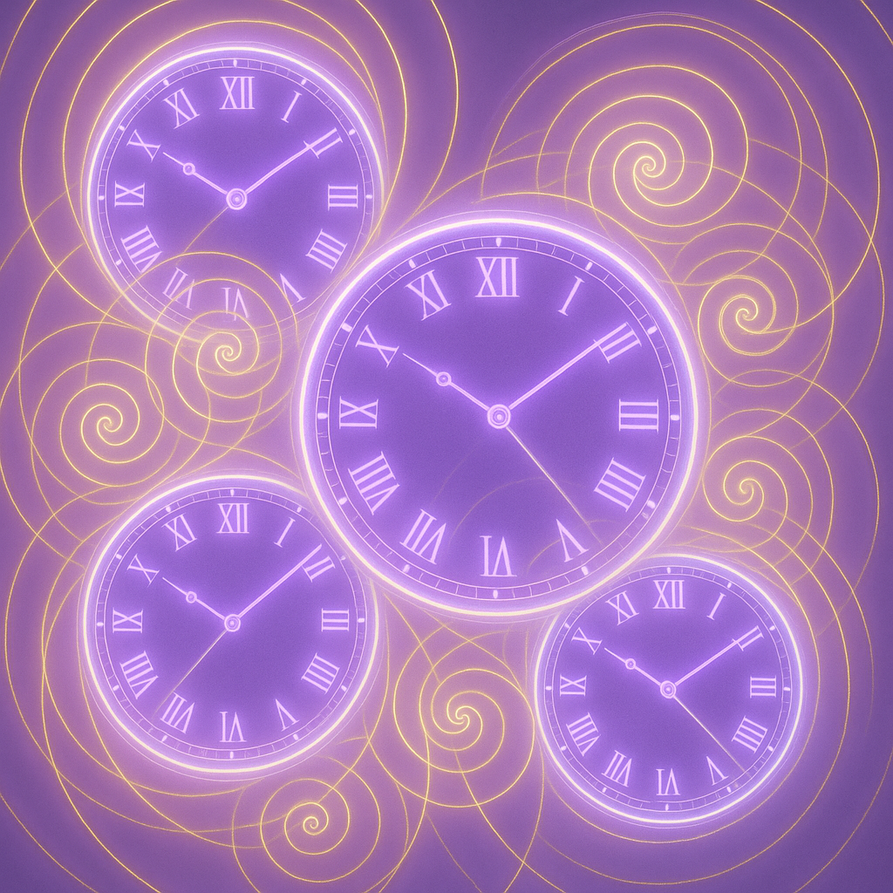

# Why Numbers Nudge Us

In a world of constant digital displays and timestamps, certain number sequences seem to appear with uncanny frequency. You glance at your phone: 11:11. A receipt totals $22.22. Your morning run clocks in at exactly 33:33. These aren't mere coincidences to millions of people worldwide—they're angel numbers, and they've become a modern language of synchronicity that bridges the mystical and the practical.

## The Pattern Recognition Mind

Human brains are wired to detect patterns. It's how our ancestors survived—spotting the tiger's stripes in tall grass, recognizing which berries were safe to eat, understanding seasonal cycles. This same neural machinery that kept us alive now fires when we notice repeating numbers. But here's where it gets interesting: the patterns we notice often align with what we need to see.

Psychologists call this "selective attention," but there's something more at play. When you're contemplating a major life change and suddenly 555 appears everywhere, your subconscious might be using these numbers as external confirmation of internal readiness. The numbers become mirrors, reflecting back what's already stirring within.

## Historical Context of Number Symbolism

Numbers have carried meaning since humans first learned to count. Pythagoras believed numbers were the building blocks of reality. Ancient Chinese numerology linked digits to cosmic forces. The Kabbalah assigned mystical properties to numerical values. Sacred geometry appears in structures from Egyptian pyramids to Gothic cathedrals.

What's new isn't the idea that numbers hold significance—it's how we're encountering them. Digital clocks, timestamps, license plates, and social media metrics create an unprecedented numerical landscape. We're swimming in numbers, and angel numbers are how many people make sense of this data deluge, transforming digital noise into personal meaning.

## Modern Angel Numbers Movement

The contemporary angel numbers phenomenon exploded through social media around 2019. What started as niche spiritual content became mainstream when millions began sharing their "11:11 make a wish" screenshots. TikTok videos about 222 meanings rack up millions of views. Instagram accounts dedicated to angel numbers attract devoted followings.

But this isn't just internet spirituality. The movement reflects a deeper hunger for meaning in an increasingly disconnected world. Angel numbers offer bite-sized mysticism—accessible, immediate, and personal. They require no guru, no expensive courses, no complex rituals. Just awareness and openness to the possibility that the universe might be winking at you through your smartphone screen.

## How to Use This Guide

This book takes a pragmatic approach to angel numbers. You won't find predictions about twin flames or promises of lottery wins. Instead, each chapter breaks down a specific number sequence with:

- **Cultural context**: Where this number's significance originated
- **Core meanings**: Common interpretations across traditions
- **Real-life triggers**: When and why you might notice this number
- **Actionable habits**: Practical steps to harness the number's energy
- **Mindfulness exercises**: Quick practices for deeper integration
- **Skeptic's corner**: Rational perspectives for the questioning mind

Read sequentially or jump to numbers that keep appearing in your life. Each chapter stands alone while building toward a comprehensive understanding of numerical synchronicity.

## Setting Intentions

Before diving into specific numbers, consider what you're seeking. Angel numbers work best when approached with clear intention rather than passive hope. Are you looking for:

- Confirmation of a decision you're contemplating?
- Encouragement during a challenging transition?
- Reminders to stay present and grateful?
- Prompts for self-reflection and growth?

Write down your current life questions. Note which areas feel stuck or unclear. This conscious acknowledgment primes your awareness to notice relevant patterns. You're not manifesting numbers—you're preparing your mind to recognize meaningful connections when they naturally occur.

## **Skeptic's Corner**

Let's be real: confirmation bias is real. When you're thinking about angel numbers, you'll notice them more. That's basic psychology, not mysticism. But consider this: even if the mechanism is purely psychological, the effects can be genuinely beneficial. If seeing 888 reminds you to check your financial goals and that leads to better money habits, does it matter whether angels or algorithms put that number in your path?

---

*Remember: Angel numbers are mirrors, not messages—they reflect what you're ready to see.*
