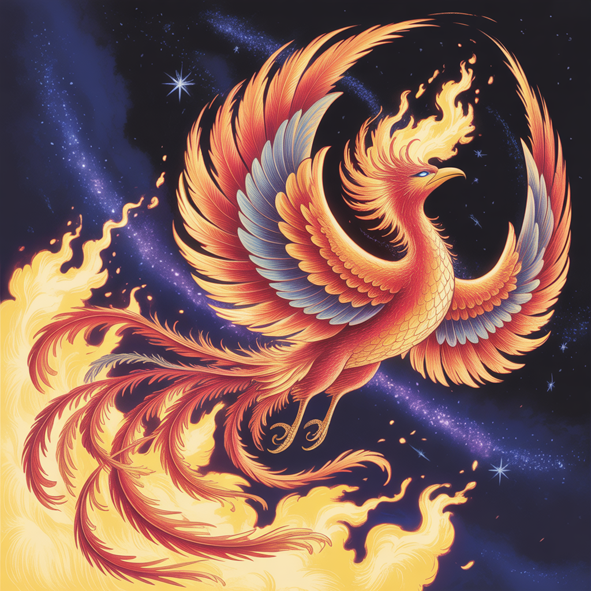
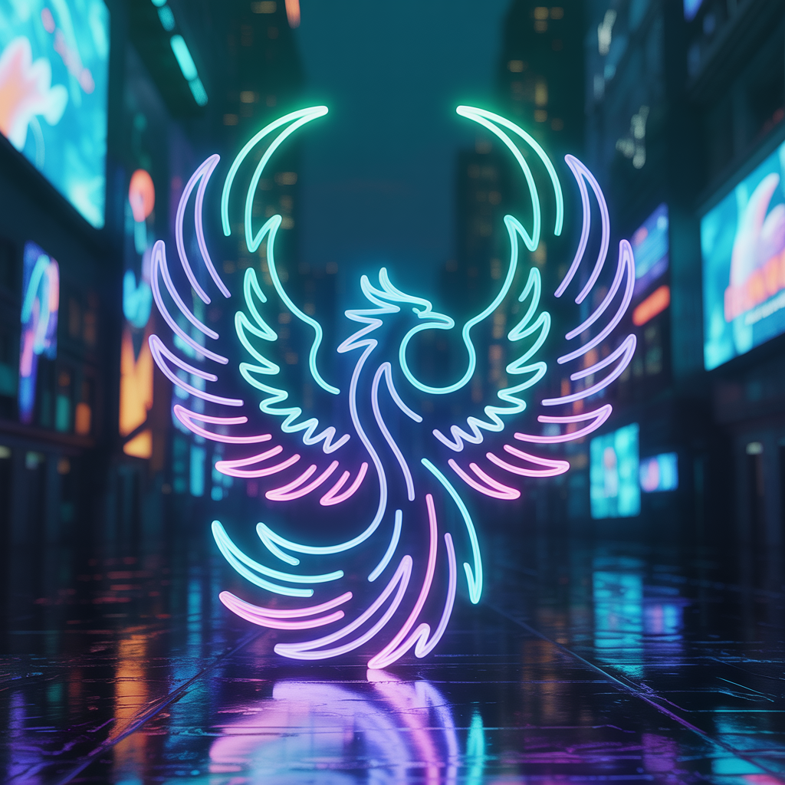

Este é um capítulo de exemplo. Substitua este conteúdo com sua introdução.

## Seção 1.1

Conteúdo da primeira seção...

## Seção 1.2

Conteúdo da segunda seção...

Let's test another image placeholder here.

This will test the new Sora-1 model.

## Test Maximum Quality

## Test Book Ad for Social Media

## Test Brand Colors

## Test New Agent

