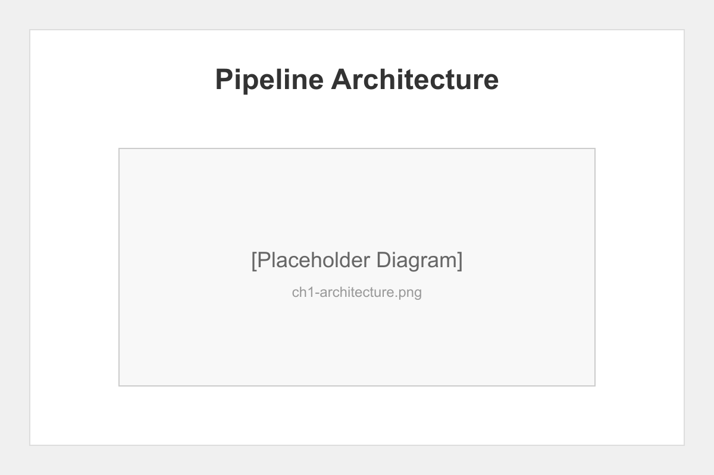
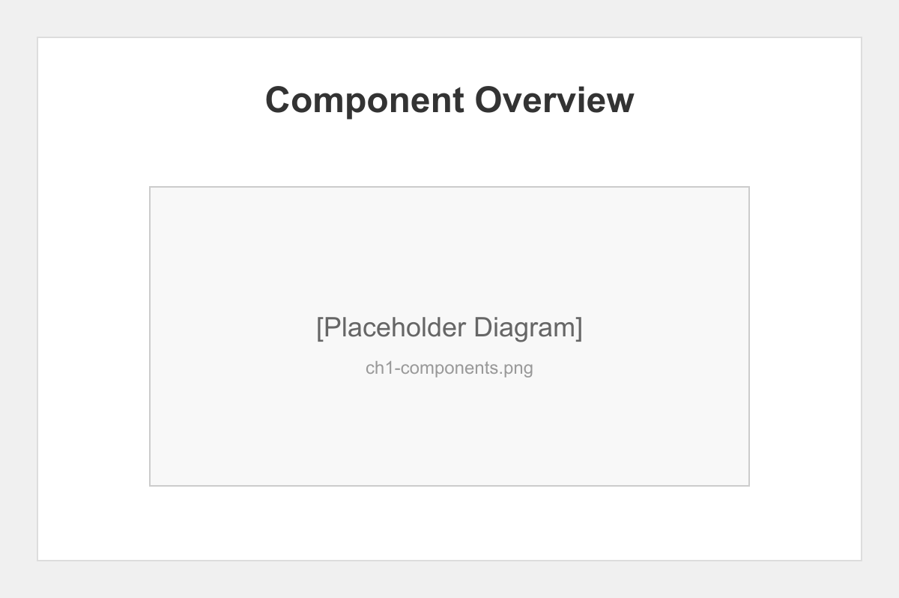

# Chapter 1: Introduction to Pipeline Testing

## Overview

This chapter introduces the Claude Elite book automation pipeline and establishes our testing objectives. We'll explore the architecture, components, and validation strategies.

## Pipeline Architecture

The Claude Elite pipeline consists of five autonomous agents:

1. **Writer Agent** - Generates and enhances content
2. **Illustrator Agent** - Creates visual assets
3. **Builder Agent** - Compiles PDF and EPUB formats
4. **QA Agent** - Validates output quality
5. **Publisher Agent** - Deploys to distribution channels

## Testing Methodology

Our testing approach covers:

- **Unit Testing** - Individual component validation
- **Integration Testing** - Inter-agent communication
- **End-to-End Testing** - Complete workflow validation
- **Stress Testing** - Concurrency and load handling
- **Recovery Testing** - Failure scenarios and rollback

## Key Components Under Test

### File Locking System
Prevents concurrent access corruption using PID-based locks.

### WebSocket Monitor
Real-time pipeline status with token authentication.

### Checkpoint System
State persistence with selective restore capabilities.

### Safe Trash
Recoverable deletion with metadata preservation.

## Success Criteria

The pipeline validation will be considered successful when:

1. All phases complete without errors
2. File locking prevents data corruption
3. Authentication blocks unauthorized access
4. Checkpoints restore correctly
5. Trash recovery functions properly
6. Output formats pass validation

## Chapter Summary

This chapter established the foundation for our pipeline testing journey. We've identified the key components and success criteria that will guide our validation efforts.

## What's Next

In Chapter 2, we'll dive deep into file system operations, testing the robustness of our file locking, trash management, and checkpoint systems.