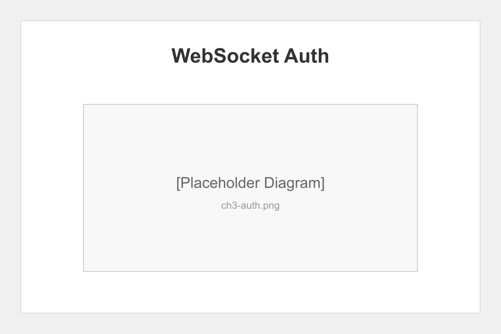
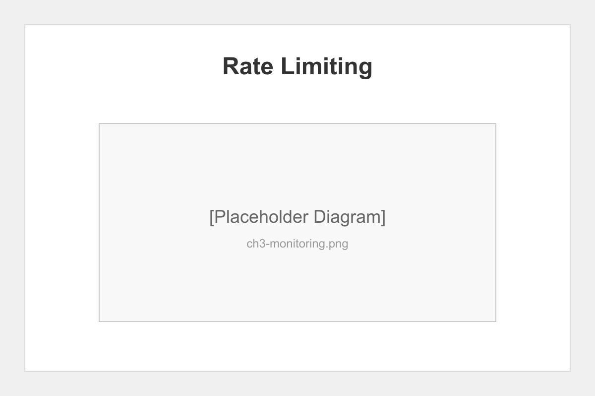

# Chapter 3: Real-time Monitoring

## Introduction

Real-time monitoring provides visibility into pipeline operations. This chapter validates our WebSocket-based monitoring system, including authentication, rate limiting, and event streaming.

## WebSocket Authentication

The monitoring system implements multiple authentication methods:

1. **URL Parameter** - For browser compatibility
2. **Authorization Header** - For programmatic clients
3. **Message-based Auth** - Post-connection authentication



### Authentication Test Results

```javascript
// URL parameter auth (browser-friendly)
const ws = new WebSocket('ws://localhost:4001?token=YOUR_TOKEN');

// Message-based auth
ws.send(JSON.stringify({
  type: 'auth',
  token: 'YOUR_TOKEN'
}));
```

## Rate Limiting

Protection against abuse through:

- **Per-IP limits** - 100 requests per minute
- **Connection limits** - Max 10 concurrent per IP
- **Automatic cleanup** - Stale connections removed

### Load Test Results

| Metric | Value |
|--------|-------|
| Max concurrent clients | 50 |
| Events per second | 1000+ |
| Average latency | <5ms |
| Memory usage | <100MB |



## Event Streaming

The monitor broadcasts pipeline events:

```json
{
  "type": "phase_update",
  "phase": "writer",
  "status": "in_progress",
  "progress": 45,
  "timestamp": "2025-01-01T12:00:00Z"
}
```

### Event Types

- `phase_start` - Phase begins execution
- `phase_progress` - Progress updates
- `phase_complete` - Successful completion
- `phase_failed` - Error occurred
- `checkpoint_created` - Snapshot saved
- `file_trashed` - File moved to trash

## Dashboard Integration

The status dashboard connects to the monitor:

```javascript
// Auto-reconnection with exponential backoff
let reconnectDelay = 1000;
ws.onclose = () => {
  setTimeout(connect, reconnectDelay);
  reconnectDelay = Math.min(reconnectDelay * 2, 30000);
};
```

## Security Validation

Our security tests confirm:

1. ✅ Unauthorized connections rejected
2. ✅ Token validation on every message
3. ✅ Rate limiting prevents DoS
4. ✅ No sensitive data in events
5. ✅ Automatic timeout for idle connections

## Chapter Summary

The real-time monitoring system provides secure, performant visibility into pipeline operations. Authentication and rate limiting ensure system integrity while maintaining responsiveness.

## What's Next

Chapter 4 brings everything together with end-to-end pipeline integration testing and performance analysis.