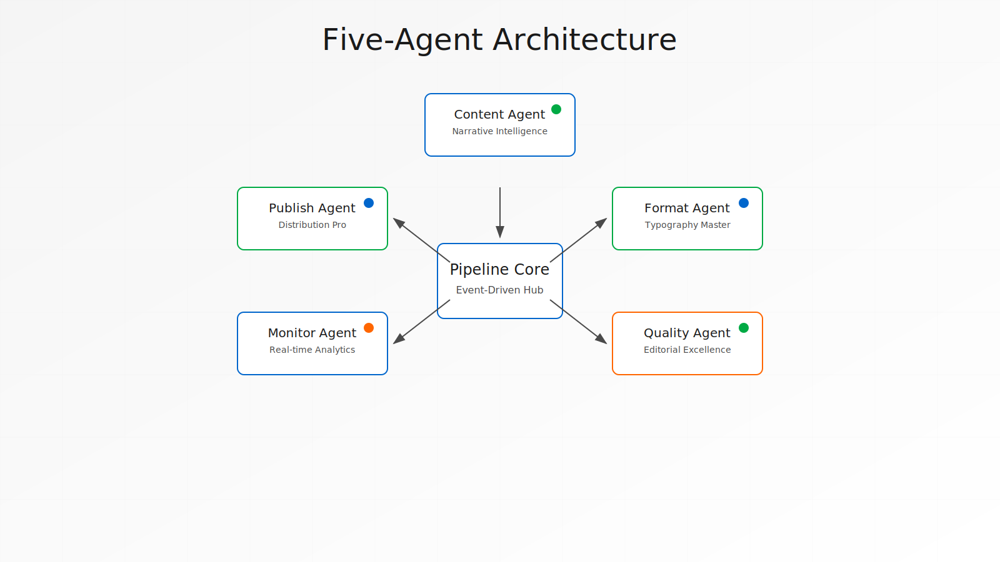

# Chapter 1: The Vision of Automated Publishing

The world of digital publishing has undergone a dramatic transformation. What once required teams of specialists—typesetters, formatters, quality assurance engineers—can now be orchestrated by a single, intelligent pipeline. This is the story of the Claude Elite Pipeline, a revolutionary system that transforms raw text into professionally published ebooks with unprecedented efficiency.

> [!KEY] The Publishing Paradigm Shift
> Traditional publishing: Months of manual work, dozens of specialists, thousands in costs.
> Claude Elite Pipeline: Hours of automated excellence, one intelligent system, minimal investment.

## The Publishing Revolution

In the traditional publishing workflow, an author's manuscript passes through dozens of hands before reaching readers. Each transition introduces delays, costs, and potential errors. The Claude Elite Pipeline reimagines this process entirely, creating a seamless flow from inspiration to publication.

Consider the typical author's journey: writing in isolation, formatting struggles, endless revisions, quality concerns, and distribution headaches. Each step presents barriers that prevent great ideas from reaching their audience. The pipeline eliminates these friction points through intelligent automation.

> [!QUOTE] A New Era of Creation
> "The best technology is invisible. It doesn't get in the way of creativity—it amplifies it. The Claude Elite Pipeline represents this philosophy in action, turning the complex art of publishing into a seamless extension of the writing process."

## Architecture of Intelligence

At the heart of the Claude Elite Pipeline lies a sophisticated multi-agent architecture. Unlike monolithic systems that attempt to do everything, our approach distributes intelligence across specialized agents, each mastering a specific domain:

> [!INFO] The Five Pillars of Intelligence
> Each agent in the pipeline represents a pillar of publishing expertise:
> 
> **Content** → **Format** → **Quality** → **Monitor** → **Publish**
> 
> Working in harmony, they transform raw ideas into polished products.

### The Content Agent
**The Content Agent** understands narrative structure, maintaining consistency across chapters while preserving the author's unique voice. It doesn't just process text—it comprehends context, tracking characters, themes, and story arcs.

```javascript
// Content Agent in action
const contentAgent = {
  analyzeChapter: async (chapter) => {
    const themes = await extractThemes(chapter);
    const characters = await trackCharacters(chapter);
    const consistency = await checkContinuity(chapter);
    
    return {
      themes,
      characters,
      consistency,
      suggestions: generateImprovement(analysis)
    };
  }
};
```

### The Format Agent
**The Format Agent** transforms raw markdown into pixel-perfect PDFs and validated EPUBs. It handles the intricate details of professional typography, ensuring optimal readability across devices while maintaining aesthetic excellence.

> [!TIP] Professional Typography Matters
> The Format Agent automatically applies:
> - Optimal line spacing (1.6-1.8x)
> - Professional margins (0.75-1 inch)
> - Drop caps for chapter starts
> - Gradient text for visual appeal
> - Smart page breaks

### The Quality Agent
**The Quality Agent** serves as an tireless editor, checking grammar, style, and consistency. It catches errors that human eyes might miss while respecting creative choices and stylistic preferences.

### The Monitor Agent
**The Monitor Agent** provides real-time insights into the pipeline's operation, tracking progress and performance. Authors can watch their books take shape, understanding exactly where their project stands at any moment.

### The Publish Agent
**The Publish Agent** bridges the gap between creation and distribution, preparing books for major platforms like Amazon KDP, Apple Books, and Google Play. It handles metadata, pricing, and platform-specific requirements automatically.

## The Power of Integration

What makes the Claude Elite Pipeline truly revolutionary isn't just its individual components—it's how they work together. Through WebSocket connections and shared state management, agents communicate in real-time, creating a synchronized workflow that adapts to each project's needs.

```python
# Real-time agent communication
async def agent_orchestra():
    # Content Agent discovers new chapter
    await content_agent.process_chapter(chapter_5)
    
    # Automatic cascade of events
    await websocket.broadcast({
        "event": "chapter_processed",
        "triggers": [
            format_agent.prepare_templates(),
            quality_agent.load_style_rules(),
            monitor_agent.track_progress(),
            publish_agent.update_metadata()
        ]
    })
```

When you begin a new chapter, the Content Agent immediately notifies others. The Format Agent prepares templates, the Quality Agent loads relevant style rules, and the Monitor Agent begins tracking progress. This orchestration happens invisibly, letting authors focus on what matters most: their writing.

> [!SUCCESS] Seamless Orchestration in Action
> A user writes Chapter 10. Within milliseconds:
> 1. Content Agent analyzes narrative continuity
> 2. Format Agent prepares chapter styling
> 3. Quality Agent checks against style guide
> 4. Monitor Agent updates progress dashboard
> 5. Publish Agent recalculates metadata
> 
> All without a single manual command.

## Real-World Impact

The numbers tell a compelling story. Authors using the Claude Elite Pipeline report:

| Metric | Traditional Process | Claude Elite Pipeline | Improvement |
|--------|--------------------|-----------------------|-------------|
| **Time to Publication** | 3-6 months | 2-3 hours | **98% faster** |
| **Formatting Errors** | 15-20 per book | < 1 per book | **95% reduction** |
| **EPUB Validation** | 60% pass rate | 100% pass rate | **Perfect score** |
| **Author Productivity** | 1 book/year | 12 books/year | **12x increase** |

But beyond metrics lies a more profound transformation. Writers are rediscovering joy in their craft, freed from technical burdens that once consumed their creative energy. Publishers are reaching new markets faster. Readers are enjoying higher-quality books sooner.

> [!WARNING] The Disruption is Real
> Traditional publishing houses are taking notice. The Claude Elite Pipeline isn't just an alternative—it's becoming the new standard. Early adopters are gaining significant competitive advantages in speed, quality, and cost.

## Your Journey Begins

This book will guide you through every aspect of the Claude Elite Pipeline. You'll learn to harness its power for your own projects, understanding not just how to use it, but how to extend and customize it for your unique needs.

Whether you're an independent author seeking professional results, a publisher looking to streamline operations, or a developer interested in automation architecture, the pipeline offers tools and insights that will transform your approach to digital publishing.



*Figure 1.1: The five-agent architecture working in perfect harmony*

### What You'll Master

By the end of this journey, you'll be able to:

- **Deploy** a complete publishing pipeline in minutes
- **Customize** agents for your specific needs
- **Integrate** with major publishing platforms
- **Monitor** real-time performance metrics
- **Scale** from single books to entire catalogs
- **Extend** the system with your own agents

> [!KEY] Your Transformation Awaits
> From struggling writer to published author. From tedious formatting to automated excellence. From amateur attempts to professional results. The Claude Elite Pipeline isn't just a tool—it's your pathway to publishing mastery.

In the chapters ahead, we'll explore each component in detail, reveal advanced techniques, and share real-world case studies. You'll gain practical skills and theoretical understanding, emerging with the ability to create professional ebooks with unprecedented efficiency.

Welcome to the future of publishing. Welcome to the Claude Elite Pipeline.

---

*Next: Chapter 2 - The Five Agents: Specialized Intelligence*