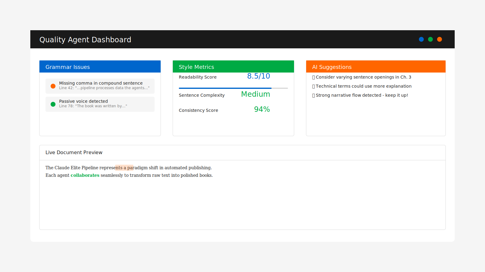

# Chapter 2: The Five Agents: Specialized Intelligence

The Claude Elite Pipeline's power emerges from its multi-agent architecture—five specialized intelligences working in concert. Each agent masters a specific domain, communicating through a sophisticated event-driven system that ensures seamless coordination. Let's meet the team that will transform your manuscripts into published masterpieces.

## The Content Agent: Guardian of Narrative

The Content Agent serves as your book's intelligent companion, understanding not just words but meaning. It maintains a living knowledge base of your work, tracking every character, location, plot thread, and stylistic choice.

### Context Management

Unlike simple text processors, the Content Agent builds a comprehensive story bible as you write:

```yaml
characters:
  sarah_chen:
    first_appearance: "chapter-02"
    description: "Data scientist with synesthesia"
    traits: ["analytical", "intuitive", "reserved"]
    relationships:
      david_kumar: "colleague_turned_romantic_interest"
```

This context awareness prevents continuity errors that plague even experienced authors. When Sarah's eye color changes inexplicably between chapters, the Content Agent alerts you immediately.

### Intelligent Assistance

The agent offers suggestions based on deep understanding of your narrative:

- Character arc completion tracking
- Pacing analysis across chapters
- Theme consistency monitoring
- Dialogue attribution verification
- Scene setting reminders

### Working with the Content Agent

Integration happens naturally through your writing environment. As you type, the agent analyzes in real-time, building its understanding without interrupting your flow. Smart notifications appear only when truly necessary, respecting your creative process.

## The Format Agent: Typography Perfectionist

Professional presentation distinguishes amateur efforts from published works. The Format Agent transforms your markdown into beautifully typeset books, handling the countless details that create reading pleasure.

### PDF Mastery

Creating print-ready PDFs requires deep understanding of typography, layout, and design principles. The Format Agent implements:

- **Professional margins** optimized for 6×9" trade paperbacks
- **Intelligent pagination** preventing orphans and widows
- **Chapter styling** with consistent opening pages
- **Font selection** balancing readability and character

### EPUB Excellence

Digital formats present unique challenges. The Format Agent ensures your EPUB files:

- Validate perfectly across all major platforms
- Adapt elegantly to different screen sizes
- Include proper metadata and navigation
- Embed images efficiently
- Support accessibility features

### Format Flexibility

Beyond standard outputs, the Format Agent adapts to special requirements:

```javascript
const formatOptions = {
  pdf: {
    pageSize: 'A5',
    margins: { top: '2cm', bottom: '2cm' },
    fontSize: '12pt',
    fontFamily: 'Garamond'
  },
  epub: {
    includePageBreaks: false,
    generateNavPoints: true,
    embedFonts: ['Merriweather', 'Roboto']
  }
};
```

## The Quality Agent: Tireless Editor

Quality assurance traditionally requires multiple human reviewers. The Quality Agent provides consistent, comprehensive checking that catches issues humans might miss while respecting creative choices.

### Multi-Layer Analysis

The agent performs simultaneous checks across multiple dimensions:

**Grammar and Spelling**: Powered by advanced language models, catching subtle errors while understanding context. It knows when "there" should be "their" but also when you're intentionally playing with language.

**Style Consistency**: Maintaining your unique voice throughout the work. If you prefer "towards" over "toward," the agent ensures consistency without imposing external style guides.

**Readability Metrics**: Analyzing sentence complexity, paragraph flow, and overall accessibility. The agent can adapt its standards based on your target audience.

### Intelligent Suggestions

Rather than rigid rule enforcement, the Quality Agent offers contextual suggestions:



*Figure 2.1: The Quality Agent provides context-aware suggestions*

- "This sentence might be clearer if split"
- "Consider varying paragraph openings in this section"
- "Character name spelling inconsistency detected"

## The Monitor Agent: Real-Time Intelligence

Visibility into complex processes reduces anxiety and enables optimization. The Monitor Agent provides comprehensive insights into your pipeline's operation through an elegant real-time dashboard.

### Performance Metrics

Track every aspect of your book's journey:

- Word count progress against targets
- Processing time for each pipeline stage
- Memory usage and system resources
- Error frequency and resolution time

### Progress Visualization

Beautiful charts and graphs transform data into understanding:

```javascript
const progressData = {
  overall: 67,
  chapters: {
    written: 8,
    edited: 6,
    formatted: 5,
    published: 0
  },
  timeline: [
    { date: '2024-01-15', words: 5000 },
    { date: '2024-01-16', words: 7500 },
    { date: '2024-01-17', words: 9000 }
  ]
};
```

### Predictive Analytics

The Monitor Agent learns from your patterns, offering insights like:

- Estimated completion dates based on writing velocity
- Optimal writing times based on productivity data
- Resource usage predictions for large projects

## The Publish Agent: Distribution Master

The final mile—getting your book into readers' hands—often proves most challenging. The Publish Agent automates distribution across major platforms while handling complex requirements.

### Platform Integration

Each publishing platform has unique demands. The Publish Agent manages:

**Amazon KDP**:
- MOBI file generation
- Metadata optimization for discoverability
- Pricing strategy implementation
- Category selection based on content analysis

**Apple Books**:
- iTunes Producer package creation
- Enhanced EPUB features
- Territory-specific pricing
- Sample generation

**Google Play Books**:
- Content adaptation for web readers
- SEO optimization
- Preview percentage configuration
- Analytics integration

### Marketing Automation

Beyond basic distribution, the Publish Agent supports marketing efforts:

- Excerpt generation for social media
- Book description A/B testing
- Review request automation
- Price promotion scheduling

## Orchestrated Intelligence

The true magic happens when all five agents work together. Through event-driven architecture and shared state management, they create a workflow that feels almost telepathic:

1. **Content Agent** detects new chapter → notifies others
2. **Format Agent** prepares templates → updates preview
3. **Quality Agent** begins analysis → queues suggestions
4. **Monitor Agent** tracks progress → updates dashboard
5. **Publish Agent** validates metadata → prepares distribution

This orchestration happens in milliseconds, creating a responsive system that adapts to your working style.

## Customization and Extension

While powerful out of the box, the agent architecture supports infinite customization:

```python
class CustomAgent(BaseAgent):
    def __init__(self):
        super().__init__('CustomAgent')
        self.register_handlers()
    
    def process_content(self, content):
        # Your specialized logic here
        return enhanced_content
```

The next chapter explores practical workflows, showing how to harness these agents for maximum productivity. You'll learn to configure, customize, and extend the system for your unique needs.