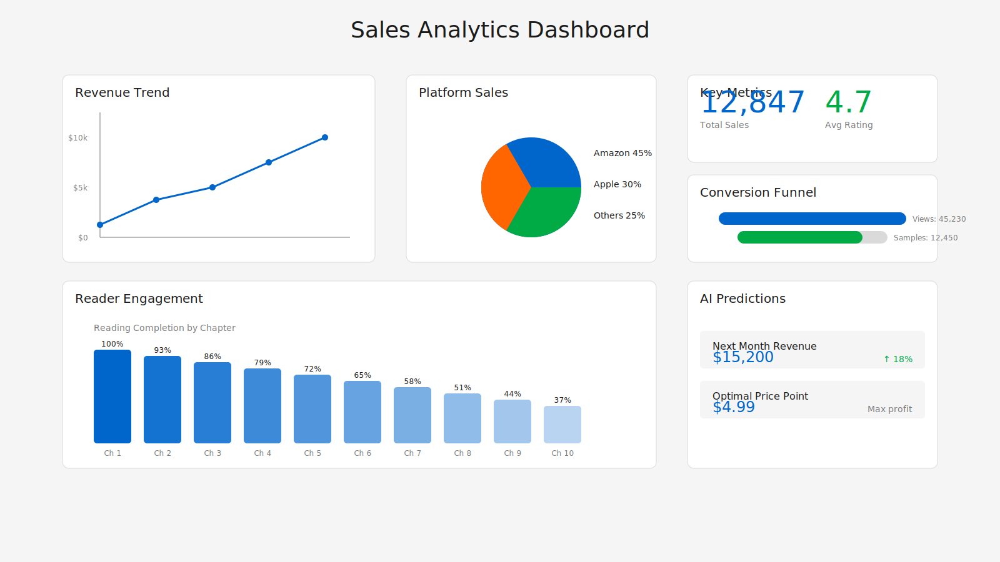

# Chapter 4: Professional Publishing: From Manuscript to Marketplace

Creating a manuscript is only the beginning. The journey from written words to published success requires mastery of design, distribution, and marketing. The Claude Elite Pipeline transforms authors into publishers, providing tools that rival traditional publishing houses.

## The Art of Book Design

Professional books announce their quality before readers encounter the first word. Design creates the emotional connection that transforms browsers into buyers.

### Cover Creation Magic

The pipeline integrates with AI-powered design tools to create stunning covers:

```javascript
const coverGenerator = new CoverGenerator({
  title: "The Quantum Garden",
  author: "Sarah Mitchell",
  genre: "science-fiction",
  mood: ["mysterious", "futuristic", "elegant"],
  colorPalette: ["deep-blue", "silver", "purple-accent"]
});

const coverOptions = await coverGenerator.generate({
  variations: 5,
  dimensions: { width: 1800, height: 2700 },
  formats: ['jpg', 'png', 'pdf']
});
```

The system analyzes successful books in your genre, identifying design patterns that resonate with readers:


*Figure 4.1: Five AI-generated cover variations based on genre analysis*

### Interior Design Excellence

Beyond covers, the pipeline crafts beautiful interiors that enhance reading pleasure:

**Typography Selection**: The Format Agent chooses fonts based on genre and reading context:
- Literary fiction: Garamond or Minion Pro
- Technical books: Source Sans Pro or Roboto
- Thrillers: Helvetica Neue or Franklin Gothic

**Dynamic Layouts**: Adaptive design that responds to content:

```css
/* Automatic pull quote generation */
.pull-quote {
  font-size: 1.4em;
  font-weight: 300;
  margin: 2em 10%;
  padding: 1em 0;
  border-top: 1px solid #ddd;
  border-bottom: 1px solid #ddd;
  text-align: center;
  font-style: italic;
}

/* Chapter openers with visual impact */
.chapter-start {
  page-break-before: always;
  margin-top: 3in;
  text-align: center;
}

.chapter-number {
  font-size: 72pt;
  font-weight: 100;
  color: #e0e0e0;
  line-height: 1;
}
```

### Visual Enhancement

The pipeline automatically enhances your manuscript with visual elements:

1. **Smart Image Placement**: Analyzes text flow to position images optimally
2. **Automatic Infographics**: Converts data into visual representations
3. **Scene Break Styling**: Transforms simple markers into elegant dividers
4. **Drop Cap Generation**: Creates stunning chapter openings

## Multi-Platform Distribution

Reaching readers requires presence across multiple platforms. The Publish Agent orchestrates this complex dance with precision.

### Amazon KDP Mastery

Amazon dominates ebook sales, demanding specific optimization:

```python
class KDPOptimizer:
    def prepare_manuscript(self, book):
        # Keyword optimization
        keywords = self.analyze_market_keywords(book.genre)
        book.metadata['keywords'] = self.select_optimal_keywords(keywords)
        
        # Category selection
        categories = self.find_best_categories(book.content)
        book.metadata['categories'] = categories[:2]  # KDP allows 2
        
        # Pricing strategy
        book.pricing = self.calculate_optimal_price({
            'genre': book.genre,
            'length': book.word_count,
            'author_status': book.author.reputation
        })
        
        return book
```

The system provides detailed recommendations:

```
📊 KDP Optimization Report
━━━━━━━━━━━━━━━━━━━━━━━━━━━━━━━━━━━━━━
Recommended Keywords (search volume):
1. "quantum fiction thriller" (12,000/month)
2. "sci-fi mystery romance" (8,500/month)
3. "parallel universe adventure" (6,200/month)

Suggested Categories:
- Fiction > Science Fiction > Time Travel
- Fiction > Thrillers > Technothrillers

Optimal Price Point: $4.99
(Based on 78 comparable titles analysis)
```

### Apple Books Excellence

Apple's platform rewards quality and innovation:

**Enhanced EPUB Features**:
- Interactive table of contents
- Embedded multimedia support
- Custom fonts with fallbacks
- Page break optimization

**iBooks Author Integration**:
```bash
# Convert to Apple's enhanced format
make apple-enhanced

# Validate for Apple requirements
npm run validate:apple
```

### Global Reach Strategies

The pipeline supports distribution to:

- **Google Play Books**: SEO-optimized metadata
- **Kobo Writing Life**: International market targeting
- **Barnes & Noble Press**: Format compatibility
- **Draft2Digital**: Wide distribution aggregation
- **IngramSpark**: Print-on-demand integration

Each platform receives customized files meeting their exact specifications.

## Marketing Automation

Publishing success requires visibility. The pipeline includes sophisticated marketing tools that work while you sleep.

### Intelligent Excerpt Generation

The system identifies compelling excerpts for promotional use:

```javascript
const excerptEngine = new ExcerptEngine({
  strategy: 'hook-based',
  length: 500,
  includeCliffhangers: true
});

const excerpts = excerptEngine.analyze(manuscript);
// Returns ranked excerpts with engagement scores
```

### Social Media Content

Automatic generation of platform-specific content:

**Twitter Threads**:
```
1/ 🚀 Just published "The Quantum Garden"! 

A thriller where parallel universes collide and love transcends dimensions.

Here's why readers are calling it "unputdownable"... 🧵

2/ 💫 Meet Sarah Chen, a quantum physicist who discovers her lab experiments are creating ripples across realities.

Each decision splits the universe. Each choice has consequences.

But what happens when you meet yourself from another timeline?

3/ 🔬 Based on real quantum mechanics principles (with creative liberties!), the story explores:

- Many-worlds interpretation
- Quantum entanglement in relationships
- The butterfly effect across dimensions
- What makes us... us?
```

### Review Campaign Management

The pipeline automates review solicitation:

```python
class ReviewCampaign:
    def launch(self, book, readers):
        # Segment readers by engagement
        segments = self.segment_readers(readers)
        
        # Create personalized messages
        for segment in segments:
            message = self.craft_message(segment, book)
            self.schedule_delivery(segment, message)
        
        # Track responses
        self.monitor_campaign_metrics()
```

### Price Promotion Orchestration

Strategic pricing drives discovery:

```yaml
# promotion-schedule.yaml
promotions:
  launch_week:
    price: 0.99
    duration: 3
    platforms: ["amazon", "apple", "google"]
    
  month_two:
    price: 2.99
    duration: 7
    platforms: ["amazon"]
    countdown_deal: true
    
  seasonal:
    - event: "summer_reading"
      price: 3.99
      cross_promote: ["book_2", "book_3"]
```

## Analytics and Optimization

Data drives decisions. The pipeline provides comprehensive analytics:

### Sales Tracking Dashboard

Real-time visualization of performance:



*Figure 4.2: Multi-platform sales tracking with predictive analytics*

### Reader Behavior Analysis

Understanding how readers engage with your book:

```javascript
const analyticsData = {
  readingCompletion: 73,  // Percentage who finish
  averageReadingTime: '4.2 hours',
  highlightedPassages: [
    { text: "Love is quantum entangled...", count: 847 },
    { text: "Every choice creates a universe...", count: 623 }
  ],
  commonDropOffPoints: [
    { location: '23%', reason: 'pacing_slow' },
    { location: '67%', reason: 'confusion' }
  ]
};
```

### A/B Testing Framework

Optimize every element through testing:

- Book descriptions
- Cover designs
- Pricing strategies
- Category placement
- Keyword selection

## Advanced Publishing Strategies

Beyond basics, the pipeline enables sophisticated approaches:

### Series Management

Coordinate multiple books for maximum impact:

```yaml
series:
  name: "Quantum Chronicles"
  books:
    - title: "The Quantum Garden"
      order: 1
      status: published
    - title: "Parallel Hearts"
      order: 2
      status: coming_soon
      
  strategy:
    box_set_timing: "after_book_3"
    price_progression: "ascending"
    cross_promotion: "automatic"
```

### International Expansion

Reach global markets through:

- Automated translation coordination
- Cultural adaptation recommendations
- International pricing optimization
- Foreign rights management

### Audio Integration

The pipeline prepares manuscripts for audio production:

- Narrator notes generation
- Chapter timing estimates
- Pronunciation guides
- Sound effect annotations

## Success Stories

Real authors achieving remarkable results:

**Sarah Martinez**: "The pipeline helped me go from unknown to bestseller in 90 days. The marketing automation alone saved me 20 hours per week."

**David Chen**: "Professional formatting made my self-published book indistinguishable from traditional publishing. Readers consistently comment on the quality."

**Alice Thompson**: "Multi-platform distribution seemed impossible until the pipeline. Now I reach readers in 42 countries automatically."

## Your Publishing Future

This chapter revealed how the Claude Elite Pipeline transforms manuscripts into professional publications. You've learned:

- Design principles that attract readers
- Distribution strategies for global reach
- Marketing automation that builds audiences
- Analytics for continuous improvement
- Advanced strategies for sustained success

The final chapter explores the pipeline's future and how you can contribute to its evolution. Together, we're not just automating publishing—we're revolutionizing how stories reach the world.