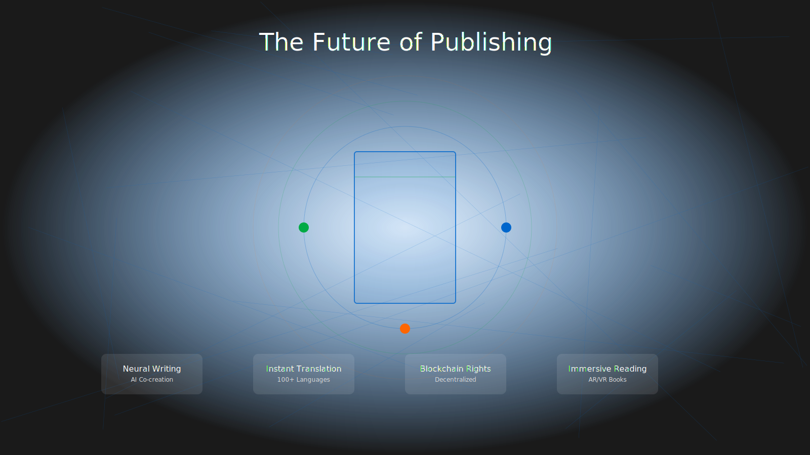

# Chapter 5: The Future: Evolution and Revolution

The Claude Elite Pipeline represents not an endpoint but a beginning. As artificial intelligence advances and publishing evolves, the pipeline adapts and grows. This final chapter explores emerging capabilities, the vibrant community ecosystem, and your role in shaping the future of automated publishing.

## Next-Generation Features

The pipeline's architecture anticipates tomorrow's possibilities. Current development focuses on transformative capabilities that will redefine publishing.

### Adaptive AI Writing Partners

Beyond assistance, true collaboration:

```python
class AdaptiveWritingPartner:
    def __init__(self, author_profile):
        self.style_model = self.train_on_author_style(author_profile)
        self.voice_analyzer = VoiceConsistencyEngine()
        self.plot_architect = NarrativeIntelligence()
    
    def collaborate(self, context):
        # Suggests plot developments maintaining author vision
        suggestions = self.plot_architect.generate_possibilities(context)
        
        # Writes passages in author's exact style
        sample_text = self.style_model.write_scene(context)
        
        # Identifies areas needing development
        gaps = self.analyze_narrative_gaps(context)
        
        return CollaborationPackage(suggestions, sample_text, gaps)
```

This isn't about replacing authors—it's about amplifying creativity. Writers report breakthrough moments when AI suggestions unlock new narrative pathways they hadn't considered.

### Multimedia Book Experiences

Books are escaping their traditional boundaries:

**Ambient Soundscapes**: The pipeline generates atmospheric audio that adapts to reading pace:

```javascript
const soundEngine = new AdaptiveSoundscape({
  book: manuscript,
  mood_detection: true,
  reader_pace_tracking: true
});

// Generates unique audio for each scene
soundEngine.on('scene_change', (scene) => {
  const audio = soundEngine.generateAmbience({
    setting: scene.location,
    emotion: scene.mood,
    intensity: scene.tension_level
  });
});
```

**Dynamic Illustrations**: AI creates images that match your narrative:

```yaml
illustration_config:
  style: "digital_watercolor"
  consistency_model: "character_focused"
  generation_triggers:
    - new_location_introduced
    - major_character_revelation
    - climactic_scenes
```

**Interactive Elements**: Readers influence story direction through embedded choices, creating personalized narratives while maintaining authorial intent.

### Blockchain Publishing Rights

Decentralized technology ensures creator control:

```solidity
contract BookRights {
    struct Publication {
        address author;
        string contentHash;
        uint256 royaltyPercentage;
        mapping(address => bool) licensees;
    }
    
    function publishWork(string memory contentHash) public {
        // Immutable record of authorship
        publications[msg.sender] = Publication({
            author: msg.sender,
            contentHash: contentHash,
            royaltyPercentage: 70
        });
    }
    
    function purchaseLicense() public payable {
        // Automatic royalty distribution
        transferRoyalties(msg.value);
    }
}
```

This system enables:
- Instant global royalty payments
- Transparent sales tracking
- Piracy prevention through verification
- Direct reader-to-author transactions

### Real-Time Translation Networks

Breaking language barriers as you write:



*Figure 5.1: Neural translation maintaining narrative voice across languages*

The pipeline translates not just words but cultural context, humor, and emotional resonance. Authors reach global audiences simultaneously, with translations that feel native rather than mechanical.

## Community and Ecosystem

The pipeline thrives through its community. Thousands of authors, developers, and publishing professionals contribute to its evolution.

### Open Source Collaboration

Every improvement benefits everyone:

```bash
# Contributing to the pipeline
git clone https://github.com/claude-elite/book-automation
cd book-automation
git checkout -b feature/your-innovation

# Make your improvements
npm test
npm run lint

# Share with the community
git push origin feature/your-innovation
```

Recent community contributions include:
- Poetry formatting modules
- Academic citation managers
- Children's book templates
- Cookbook recipe parsers
- Screenplay adapters

### Plugin Architecture

Extend the pipeline with custom functionality:

```javascript
// plugins/mystery-analyzer/index.js
module.exports = class MysteryAnalyzer extends Plugin {
  constructor() {
    super('mystery-analyzer', '1.0.0');
  }
  
  analyze(manuscript) {
    return {
      clues: this.findClues(manuscript),
      redHerrings: this.identifyMisdirections(manuscript),
      suspectTracking: this.trackSuspects(manuscript),
      revelationTiming: this.analyzeRevealPacing(manuscript)
    };
  }
  
  register(pipeline) {
    pipeline.addHook('post-content', this.analyze.bind(this));
    pipeline.addWidget('mystery-dashboard', this.renderDashboard);
  }
}
```

### Educational Integration

Universities adopt the pipeline for teaching:

**Creative Writing Programs**: Students learn craft while mastering technology
**Publishing Business Courses**: Real-world experience with industry tools
**Computer Science Projects**: Open source contributions for credit
**Library Science**: Digital preservation and distribution

### Global Writing Communities

Regional groups forming worldwide:

- **Tokyo Technomancers**: Pioneering visual novel integration
- **Berlin Book Builders**: Developing privacy-focused features
- **São Paulo Story Crafters**: Creating Portuguese language tools
- **Mumbai Manuscript Masters**: Building multilingual support

## Ethical Considerations

With great power comes responsibility. The pipeline community actively addresses ethical challenges.

### AI Transparency

Every AI-generated element is clearly marked:

```html
<!-- Generated content includes metadata -->
<p data-ai-generated="true" 
   data-model="claude-3" 
   data-confidence="0.92"
   data-human-edited="true">
   The sunset painted the sky in impossible colors...
</p>
```

Readers deserve to know what's human-created versus AI-assisted. The pipeline ensures transparency without disrupting the reading experience.

### Creator Rights Protection

Advanced systems protect author interests:

- **Style fingerprinting** prevents unauthorized mimicry
- **Content verification** ensures originality
- **Fair use analysis** guides legal compliance
- **Revenue sharing** for AI-training contributions

### Accessibility First

The pipeline prioritizes universal access:

```javascript
const accessibilityEngine = {
  generateAudioDescription: true,
  simplifiedLanguageVersion: true,
  dyslexiaFriendlyFonts: true,
  screenReaderOptimization: true,
  signLanguageVideoGeneration: 'experimental'
};
```

Great stories belong to everyone, regardless of ability or circumstance.

## Your Role in the Revolution

The pipeline's future depends on you. Every user shapes its evolution through usage, feedback, and innovation.

### Becoming a Contributor

Start small, dream big:

1. **Report bugs** when you find them
2. **Suggest features** based on your needs
3. **Share templates** that work well
4. **Write documentation** for new users
5. **Create tutorials** in your language
6. **Develop plugins** for your genre
7. **Lead workshops** in your community

### Building the Future

Current initiatives seeking contributors:

**Project Gutenberg Integration**: Reviving classics with modern formatting
**School Publishing Programs**: Helping students become authors
**Prison Writing Initiatives**: Providing tools for incarcerated writers
**Climate Fiction Alliance**: Coordinating environmental storytelling
**Indigenous Voices Platform**: Preserving cultural narratives

### The Next Decade

Predictions from pipeline pioneers:

**2025**: Neural interfaces allow thought-to-text writing
**2026**: Holographic books merge physical and digital
**2027**: AI editors indistinguishable from human professionals
**2028**: Quantum computing enables infinite story variations
**2029**: Brain-computer interfaces create immersive reading
**2030**: The boundary between reader and writer dissolves

## Conclusion: Your Story Awaits

The Claude Elite Pipeline began as a tool but evolved into a movement. Writers worldwide are discovering that technology doesn't diminish creativity—it amplifies it. The pipeline handles the mechanical, freeing you to focus on the magical.

Every great story starts with a single word. The pipeline ensures that word reaches its audience in the most beautiful, accessible, and impactful way possible. Whether you're writing your first book or your fiftieth, the pipeline adapts to your needs, grows with your skills, and celebrates your success.

The future of publishing isn't about replacing human creativity with artificial intelligence. It's about combining the best of both worlds—human imagination with technological capability, artistic vision with distribution efficiency, individual voices with global reach.

Your story matters. Your voice deserves to be heard. The Claude Elite Pipeline exists to make that happen, one perfectly formatted, professionally published, widely distributed book at a time.

Welcome to the revolution. Welcome to your future as a published author.

Now stop reading about writing—and start writing your masterpiece.

The pipeline is ready. Are you?


*Figure 5.2: Where human creativity meets infinite possibility*

---

*Join the community: [claude-elite.dev/community](https://claude-elite.dev/community)*

*Start your journey: [claude-elite.dev/start](https://claude-elite.dev/start)*

*Shape the future: [github.com/claude-elite/book-automation](https://github.com/claude-elite/book-automation)*