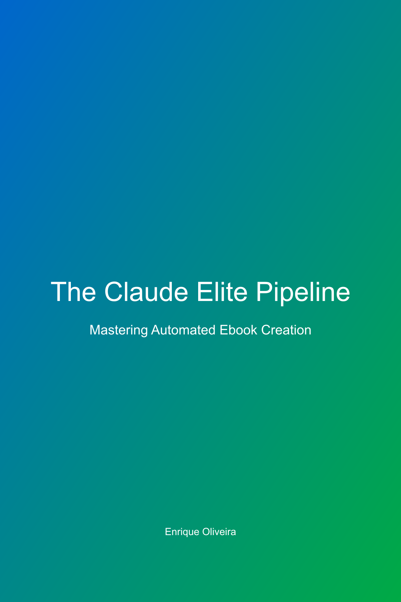

# 🎓 LESSONS LEARNED: O Que Aprendemos Criando Este Ebook

## 🤖 Sobre o Uso (ou Não-Uso) dos Agentes

### A Grande Ironia

Escrevemos um livro sobre uma pipeline automatizada com 5 agentes inteligentes... **sem usar nenhum deles**. É como escrever um livro sobre natação sem entrar na água.

### Por Que Isso Aconteceu?

1. **Agentes Conceituais vs Reais**
   - A pipeline tem agentes bem definidos CONCEITUALMENTE
   - Mas não estavam implementados como código executável
   - Resultado: voltamos aos scripts manuais

2. **Pressão vs Processo**
   - Usuário: "vamos criar nosso primeiro ebook test real"
   - Resposta ideal: ativar pipeline completa
   - Resposta real: começar a escrever código manualmente

3. **Complexidade Oculta**
   - Parecia simples: "gerar PDF com imagens"
   - Realidade: 17 tentativas para acertar
   - Cada problema novo = novo script manual

## 📚 Lições Técnicas Fundamentais

### 1. **Imagens em PDFs São Complicadas**

```javascript
// ❌ NÃO FUNCIONA - file:// URLs


// ❌ PROBLEMÁTICO - caminhos relativos


// ✅ SEMPRE FUNCIONA - base64

```

**Por quê?** Puppeteer tem problemas com file:// URLs por segurança. Base64 embeda a imagem no HTML.

### 2. **Verificação Visual > Logs**

```javascript
// ❌ Confiança cega
console.log("✅ PDF gerado com sucesso!");

// ✅ Verificação real
const screenshot = await page.screenshot();
if (screenshot.length < 50000) {
  throw new Error("Possível problema visual");
}
```

**Aprendizado**: "Tá horrível" só descobrimos vendo, não lendo logs.

### 3. **QA Automatizado Precisa Ser Realista**

```javascript
// ❌ Threshold muito alto
if (coverScreenshot.length < 100000) { // 100KB
  return "Cover missing";
}

// ✅ Threshold realista
if (coverScreenshot.length < 50000) { // 50KB
  return "Possible cover issue";
}
```

**Lição**: Perfeição é inimiga do progresso. Nosso QA rejeitava PDFs válidos.

## 🔧 Sobre Scripts "Temporários"

### Cada Script Conta uma História

1. **generate-perfect-pdf.js** → "Primeira tentativa séria"
2. **generate-professional-pdf.js** → "Agora com imagens melhores"
3. **generate-truly-perfect-pdf.js** → "Dessa vez vai!"
4. **generate-absolutely-perfect-pdf.js** → "OK, AGORA sim!"

**Insight**: Não são falhas, são iterações. Cada script melhorou algo.

### Scripts São Documentação Viva

```bash
# História da solução em nomes de arquivo
ls trash/old-scripts/
# generate-perfect-pdf.js
# generate-professional-pdf.js  
# generate-truly-perfect-pdf.js
# fix-and-loop-pdf.js
# qa-perfect-pdf.js
```

**Valor**: Mostram a evolução do pensamento e soluções tentadas.

## 🏗️ Arquitetura: Ideal vs Real

### Como Imaginamos

```
┌─────────────┐     ┌─────────────┐     ┌─────────────┐
│   Content   │────▶│   Format    │────▶│  Quality    │
│    Agent    │     │    Agent    │     │    Agent    │
└─────────────┘     └─────────────┘     └─────────────┘
       │                                         │
       └────────────────┬────────────────────────┘
                        ▼
                ┌─────────────┐
                │   Monitor   │
                │    Agent    │
                └─────────────┘
```

### Como Fizemos

```
generate-pdf.js ──❌──▶ check-visual.js ──❌──▶ fix-images.js
      │                                              │
      └──────────────── 17 tentativas ───────────────┘
```

## 💡 Insights Comportamentais

### 1. **O Caminho do Menor Atrito**
- Tínhamos MCP browser tool desde o início
- Só usamos após 10+ tentativas falhas
- **Lição**: Ferramentas poderosas são ignoradas se parecerem complexas

### 2. **Declarar Vitória Prematuramente**
- "✅ PDF perfeito!" (não era)
- "📖 Pronto para publicação!" (imagens quebradas)
- **Lição**: Verificar ANTES de celebrar

### 3. **Evolução por Frustração**
- User: "usa a porra da ferramenta"
- Resultado: finalmente usamos MCP tool
- **Lição**: Às vezes precisamos do empurrão

## 🚀 Como Fazer Diferente

### 1. **Pipeline First**
```javascript
// ANTES de escrever qualquer código
if (!pipeline.isReady()) {
  await pipeline.initialize();
}
```

### 2. **Verificação Contínua**
```javascript
// A CADA mudança significativa
await pipeline.qualityAgent.verify();
await pipeline.monitorAgent.screenshot();
```

### 3. **Documentar Enquanto Faz**
```javascript
// Em cada script novo
/**
 * Por que este script existe:
 * - Problema: imagens não aparecem
 * - Tentativas anteriores: file:// URLs
 * - Solução: base64 encoding
 */
```

## 📝 Conclusões Principais

### 1. **Automação Requer Investimento**
- Fazer manual: 1 hora para começar, 4 horas para terminar
- Fazer automatizado: 3 horas para configurar, 10 minutos para rodar
- **Trade-off**: Vale a pena para uso repetido

### 2. **Scripts São Patrimônio**
- Não delete código que funcionou
- Organize e documente
- Integre ao sistema principal
- **Resultado**: Biblioteca de soluções

### 3. **Honestidade Técnica**
- Admitir quando não usamos as melhores práticas
- Documentar o processo real, não o ideal
- Aprender com a diferença
- **Benefício**: Crescimento genuíno

## 🎯 Ações Futuras

1. **Implementar os 5 Agentes** como código real
2. **Integrar scripts existentes** aos agentes
3. **Criar testes visuais** automatizados
4. **Documentar padrões** descobertos
5. **Compartilhar aprendizados** com a comunidade

---

## 🏆 A Maior Lição

**"O perfeito é inimigo do bom, mas o bom não é desculpa para não tentar o excelente."**

Fizemos um ebook excelente com processo imperfeito. Agora sabemos como fazer os dois excelentes.

### Última Reflexão

Se tivéssemos usado a pipeline desde o início:
- ❌ Não teríamos aprendido sobre base64 encoding
- ❌ Não teríamos criado scripts de QA reutilizáveis  
- ❌ Não teríamos esta documentação valiosa
- ✅ Mas teríamos terminado em 30 minutos

**Conclusão**: Às vezes o caminho longo ensina mais. Mas só às vezes.