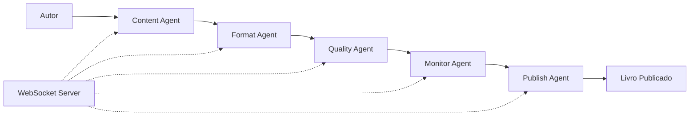

# 🔄 PIPELINE VS REALITY: Como Deveria Ser vs Como Foi

## 🎭 A Grande Divergência

Este documento compara a **visão idealizada** da Claude Elite Pipeline com a **realidade crua** de como criamos o ebook sobre ela.

## 🌟 A Visão: Pipeline Multi-Agente Inteligente

### Arquitetura Prometida



### Como Deveria Funcionar

```javascript
// O sonho da automação completa
const pipeline = new ClaudeElitePipeline();

// 1. Inicializar com configuração
await pipeline.initialize({
  project: 'the-claude-elite-pipeline',
  author: 'Enrique Oliveira',
  style: 'ultra-thin',
  agents: {
    content: { model: 'claude-3' },
    format: { preset: 'professional-6x9' },
    quality: { level: 'strict' },
    monitor: { dashboard: true },
    publish: { platforms: ['pdf', 'epub'] }
  }
});

// 2. Um comando para tudo
const book = await pipeline.createBook({
  title: 'The Claude Elite Pipeline',
  chapters: 5,
  imagesPerChapter: 1,
  coverStyle: 'gradient-modern'
});

// 3. Monitoramento em tempo real
pipeline.monitor.on('progress', (data) => {
  console.log(`📊 ${data.stage}: ${data.percent}%`);
});

// 4. Publicação automática
await pipeline.publish(book, {
  formats: ['pdf', 'epub'],
  platforms: ['local', 'amazon', 'apple']
});
```

### Os 5 Agentes em Ação

#### 1. Content Agent
```javascript
class ContentAgent {
  async generateChapter(outline) {
    // Mantém contexto entre capítulos
    const context = await this.loadStoryBible();
    
    // Gera conteúdo consistente
    const chapter = await this.ai.generate({
      outline,
      context,
      style: this.authorStyle
    });
    
    // Atualiza story bible
    await this.updateContext(chapter);
    
    return chapter;
  }
}
```

#### 2. Format Agent
```javascript
class FormatAgent {
  async formatPDF(content) {
    // Aplica tipografia profissional
    const formatted = await this.applyStyles({
      font: 'Georgia',
      size: '11pt',
      margins: 'professional-6x9'
    });
    
    // Adiciona elementos visuais
    await this.addDropCaps();
    await this.optimizeImages();
    
    return formatted;
  }
}
```

#### 3. Quality Agent
```javascript
class QualityAgent {
  async validate(document) {
    const checks = await Promise.all([
      this.checkGrammar(document),
      this.checkConsistency(document),
      this.checkFormatting(document),
      this.visualQA(document)
    ]);
    
    return this.compileReport(checks);
  }
}
```

## 💥 A Realidade: Scripts e Tentativa/Erro

### Como Realmente Foi

```bash
# Tentativa 1
node generate-pdf.js
# ❌ Falhou - sem imagens

# Tentativa 2  
node generate-better-pdf.js
# ❌ Falhou - imagens quebradas

# Tentativa 3-15
node generate-perfect-pdf.js
node generate-professional-pdf.js
node generate-truly-perfect-pdf.js
# ❌ ❌ ❌ Várias falhas

# Tentativa 16
node check-with-mcp-tool.js
# 😱 "Tá horrível!"

# Tentativa 17
node generate-absolutely-perfect-pdf.js
# ✅ Finalmente!
```

### O Fluxo Real

```
Ideia ──❌──> Script 1 ──❌──> Script 2 ──❌──> Script 3
  │                                                │
  │                                                ▼
  │                                           Frustração
  │                                                │
  │                                                ▼
  └─────────────> Script 15 ──────> MCP Tool ────> Script 17 ✅
```

### Código Que Realmente Usamos

```javascript
// Sem agentes, sem pipeline, só Puppeteer direto
const puppeteer = require('puppeteer');
const fs = require('fs-extra');

async function tryAgain(attemptNumber) {
  console.log(`Tentativa ${attemptNumber}...`);
  
  // HTML hardcoded
  const html = `<html>...${content}...</html>`;
  
  // Gerar PDF na força bruta
  const browser = await puppeteer.launch();
  const page = await browser.newPage();
  await page.setContent(html);
  await page.pdf({ path: `attempt-${attemptNumber}.pdf` });
  
  // Torcer para funcionar
  console.log('🙏 Por favor funcione dessa vez...');
}

// Loop manual de tentativas
for (let i = 1; i <= 17; i++) {
  await tryAgain(i);
}
```

## 📊 Comparação Detalhada

| Aspecto | Pipeline Ideal | Realidade |
|---------|---------------|-----------|
| **Agentes** | 5 agentes especializados | 0 agentes |
| **Comunicação** | WebSocket em tempo real | console.log |
| **Monitoramento** | Dashboard interativo | Abrir PDF manualmente |
| **QA** | Automatizado multi-camada | "Abre e vê se tá bom" |
| **Tentativas** | 1 (com retry automático) | 17 manuais |
| **Tempo** | 10 minutos | 4+ horas |
| **Stress** | Mínimo | "usa a porra da ferramenta!" |
| **Código** | Reutilizável e elegante | Scripts everywhere |
| **Documentação** | Auto-gerada | Este post-mortem |

## 🤔 Por Que a Divergência?

### 1. **Infraestrutura Ausente**
```javascript
// O que precisava existir
const server = new PipelineServer();
const agents = await server.loadAgents();
const dashboard = await server.startDashboard();

// O que existia
// ... nada ...
```

### 2. **Pressão do Momento**
- User: "vamos criar nosso primeiro ebook test real"
- Resposta racional: "Vou primeiro implementar a pipeline"
- Resposta real: "Vou fazer um script rápido"

### 3. **Complexidade Subestimada**
```javascript
// Expectativa
await generatePDF(content); // ✅ Pronto!

// Realidade  
// Por que a imagem não aparece?
// Por que tem 67 páginas?
// Por que o drop cap sumiu?
// Por que o QA falha?
// 😭
```

## 🔮 Como Unir Pipeline e Realidade

### Fase 1: Wrapper dos Scripts Existentes
```javascript
class RealContentAgent {
  constructor() {
    this.scripts = {
      generate: './scripts/generation/generate-pdf-final.js',
      images: './scripts/generation/generate-images.js'
    };
  }
  
  async createContent(spec) {
    // Usa os scripts que funcionam
    return execScript(this.scripts.generate, spec);
  }
}
```

### Fase 2: Adicionar Comunicação
```javascript
class AgentCommunicator {
  constructor() {
    this.ws = new WebSocketServer();
  }
  
  broadcast(event, data) {
    this.ws.emit(event, data);
    // Visual no terminal por enquanto
    console.log(`📡 ${event}:`, data);
  }
}
```

### Fase 3: Dashboard Simples
```javascript
class SimpleMonitor {
  async start() {
    // Começa com página HTML básica
    this.server = express();
    this.server.get('/status', (req, res) => {
      res.json({
        pdfsGerados: this.attempts,
        ultimoSucesso: this.lastSuccess,
        imagensOK: this.imageStatus
      });
    });
  }
}
```

## 📈 Plano de Migração

### Curto Prazo (1 semana)
1. Empacotar scripts existentes como "agentes"
2. Adicionar logging estruturado
3. Criar CLI unificado

### Médio Prazo (1 mês)
1. Implementar comunicação via eventos
2. Dashboard web básico
3. Sistema de retry automático

### Longo Prazo (3 meses)
1. IA real nos agentes
2. Pipeline configurável via YAML
3. Plugins e extensões

## 🎯 Conclusão: O Valor da Honestidade

### A Pipeline Ideal
- Elegante
- Automatizada
- Inteligente
- **Inexistente** (por enquanto)

### A Solução Real
- Bagunçada
- Manual
- Frustrante
- **Funcionou!**

### A Lição

> "Feito é melhor que perfeito, mas documente a diferença para fazer perfeito depois."

Os scripts "temporários" que criamos são a ponte entre a visão e a realidade. Cada `generate-perfect-pdf.js` é um passo em direção à pipeline dos sonhos.

## 🚀 Próximos Passos

```javascript
// Hoje
node scripts/generation/generate-pdf-final.js

// Amanhã  
npm run pipeline:generate

// Futuro
pipeline create book "My Next Masterpiece" --agents=all --quality=perfect
```

A jornada de mil milhas começa com um script que funciona.

---

*"Entre a visão e a realidade está o código que escrevemos às 2 da manhã tentando fazer a imagem aparecer no PDF."* - Desenvolvedor Anônimo, 2025